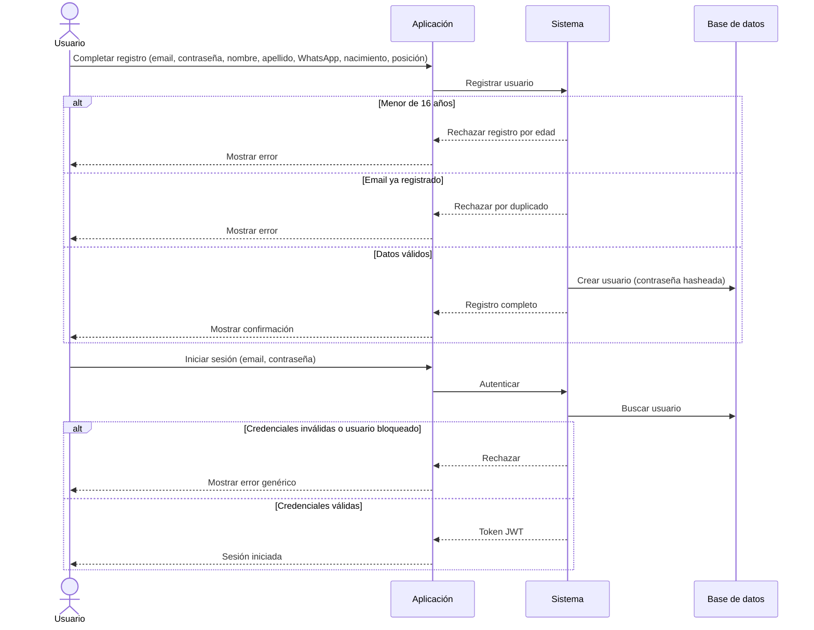

# Registro y login (RQ1)

Nuevo: el doc viejo no tenía este diagrama.

```mermaid
sequenceDiagram
    actor U as Usuario
    participant A as Aplicación
    participant S as Sistema
    participant BD as Base de datos

    U->>A: Completar registro (email, contraseña, nombre, apellido, WhatsApp, nacimiento, posición)
    A->>S: Registrar usuario
    alt Menor de 16 años
        S-->>A: Rechazar registro por edad
        A-->>U: Mostrar error
    else Email ya registrado
        S-->>A: Rechazar por duplicado
        A-->>U: Mostrar error
    else Datos válidos
        S->>BD: Crear usuario (contraseña hasheada)
        S-->>A: Registro completo
        A-->>U: Mostrar confirmación
    end

    U->>A: Iniciar sesión (email, contraseña)
    A->>S: Autenticar
    S->>BD: Buscar usuario
    alt Credenciales inválidas o usuario bloqueado
        S-->>A: Rechazar
        A-->>U: Mostrar error genérico
    else Credenciales válidas
        S-->>A: Token JWT
        A-->>U: Sesión iniciada
    end
```
