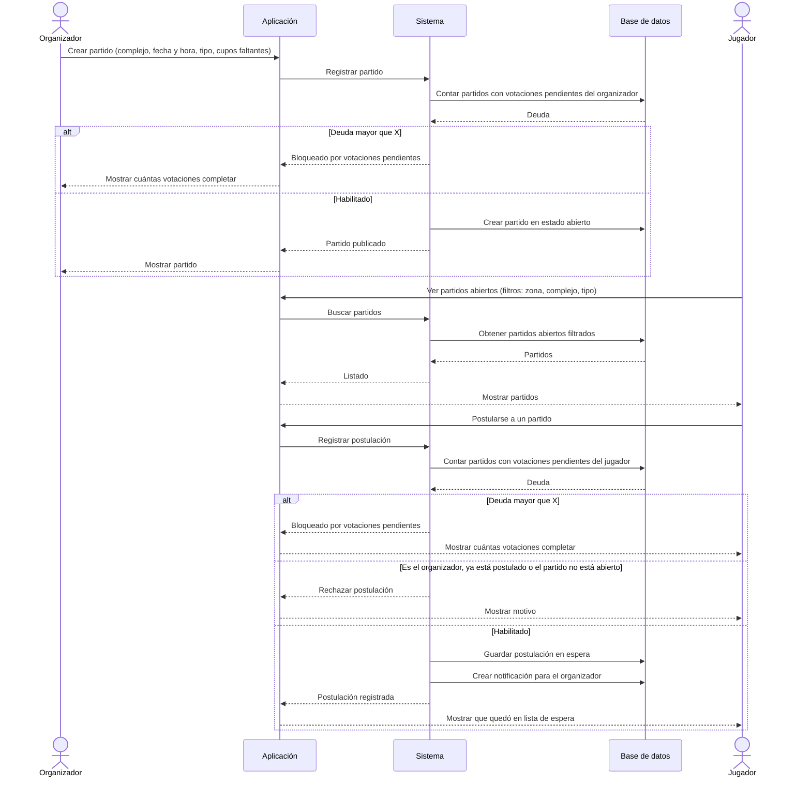

# Publicar partido y postularse (RQ4, RQ5)

Cambios contra el doc viejo: sin mapa ni canchas suscriptas, sin alerta separada, partido con cupos, deuda cuenta por partido.

```mermaid
sequenceDiagram
    actor O as Organizador
    participant A as Aplicación
    participant S as Sistema
    participant BD as Base de datos
    actor J as Jugador

    O->>A: Crear partido (complejo, fecha y hora, tipo, cupos faltantes)
    A->>S: Registrar partido
    S->>BD: Contar partidos con votaciones pendientes del organizador
    BD-->>S: Deuda
    alt Deuda mayor que X
        S-->>A: Bloqueado por votaciones pendientes
        A-->>O: Mostrar cuántas votaciones completar
    else Habilitado
        S->>BD: Crear partido en estado abierto
        S-->>A: Partido publicado
        A-->>O: Mostrar partido
    end

    J->>A: Ver partidos abiertos (filtros: zona, complejo, tipo)
    A->>S: Buscar partidos
    S->>BD: Obtener partidos abiertos filtrados
    BD-->>S: Partidos
    S-->>A: Listado
    A-->>J: Mostrar partidos

    J->>A: Postularse a un partido
    A->>S: Registrar postulación
    S->>BD: Contar partidos con votaciones pendientes del jugador
    BD-->>S: Deuda
    alt Deuda mayor que X
        S-->>A: Bloqueado por votaciones pendientes
        A-->>J: Mostrar cuántas votaciones completar
    else Es el organizador, ya está postulado o el partido no está abierto
        S-->>A: Rechazar postulación
        A-->>J: Mostrar motivo
    else Habilitado
        S->>BD: Guardar postulación en espera
        S->>BD: Crear notificación para el organizador
        S-->>A: Postulación registrada
        A-->>J: Mostrar que quedó en lista de espera
    end
```
