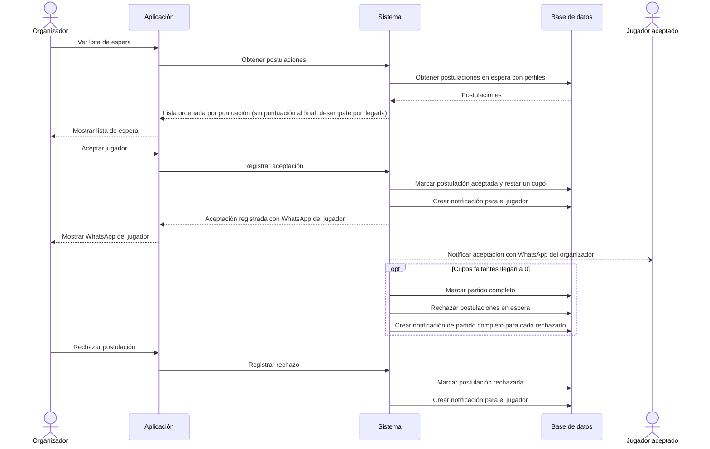

# Aceptar jugador y compartir WhatsApp (RQ6)

```mermaid
sequenceDiagram
    actor O as Organizador
    participant A as Aplicación
    participant S as Sistema
    participant BD as Base de datos
    actor J as Jugador aceptado

    O->>A: Ver lista de espera
    A->>S: Obtener postulaciones
    S->>BD: Obtener postulaciones en espera con perfiles
    BD-->>S: Postulaciones
    S-->>A: Lista ordenada por puntuación (sin puntuación al final, desempate por llegada)
    A-->>O: Mostrar lista de espera

    O->>A: Aceptar jugador
    A->>S: Registrar aceptación
    S->>BD: Marcar postulación aceptada y restar un cupo
    S->>BD: Crear notificación para el jugador
    S-->>A: Aceptación registrada con WhatsApp del jugador
    A-->>O: Mostrar WhatsApp del jugador
    S--)J: Notificar aceptación con WhatsApp del organizador

    opt Cupos faltantes llegan a 0
        S->>BD: Marcar partido completo
        S->>BD: Rechazar postulaciones en espera
        S->>BD: Crear notificación de partido completo para cada rechazado
    end

    O->>A: Rechazar postulación
    A->>S: Registrar rechazo
    S->>BD: Marcar postulación rechazada
    S->>BD: Crear notificación para el jugador
```
