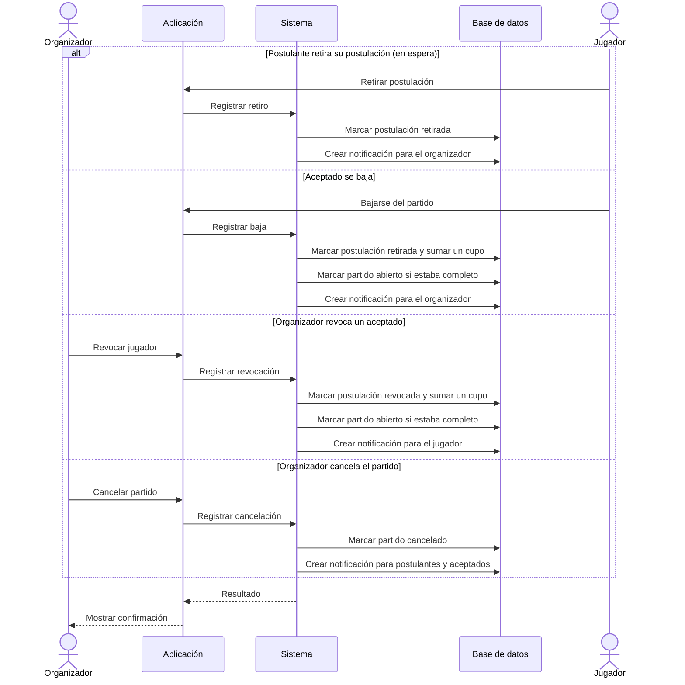

# Cancelaciones (RQ7)

```mermaid
sequenceDiagram
    actor O as Organizador
    participant A as Aplicación
    participant S as Sistema
    participant BD as Base de datos
    actor J as Jugador

    alt Postulante retira su postulación (en espera)
        J->>A: Retirar postulación
        A->>S: Registrar retiro
        S->>BD: Marcar postulación retirada
        S->>BD: Crear notificación para el organizador
    else Aceptado se baja
        J->>A: Bajarse del partido
        A->>S: Registrar baja
        S->>BD: Marcar postulación retirada y sumar un cupo
        S->>BD: Marcar partido abierto si estaba completo
        S->>BD: Crear notificación para el organizador
    else Organizador revoca un aceptado
        O->>A: Revocar jugador
        A->>S: Registrar revocación
        S->>BD: Marcar postulación revocada y sumar un cupo
        S->>BD: Marcar partido abierto si estaba completo
        S->>BD: Crear notificación para el jugador
    else Organizador cancela el partido
        O->>A: Cancelar partido
        A->>S: Registrar cancelación
        S->>BD: Marcar partido cancelado
        S->>BD: Crear notificación para postulantes y aceptados
    end
    S-->>A: Resultado
    A-->>O: Mostrar confirmación
```
