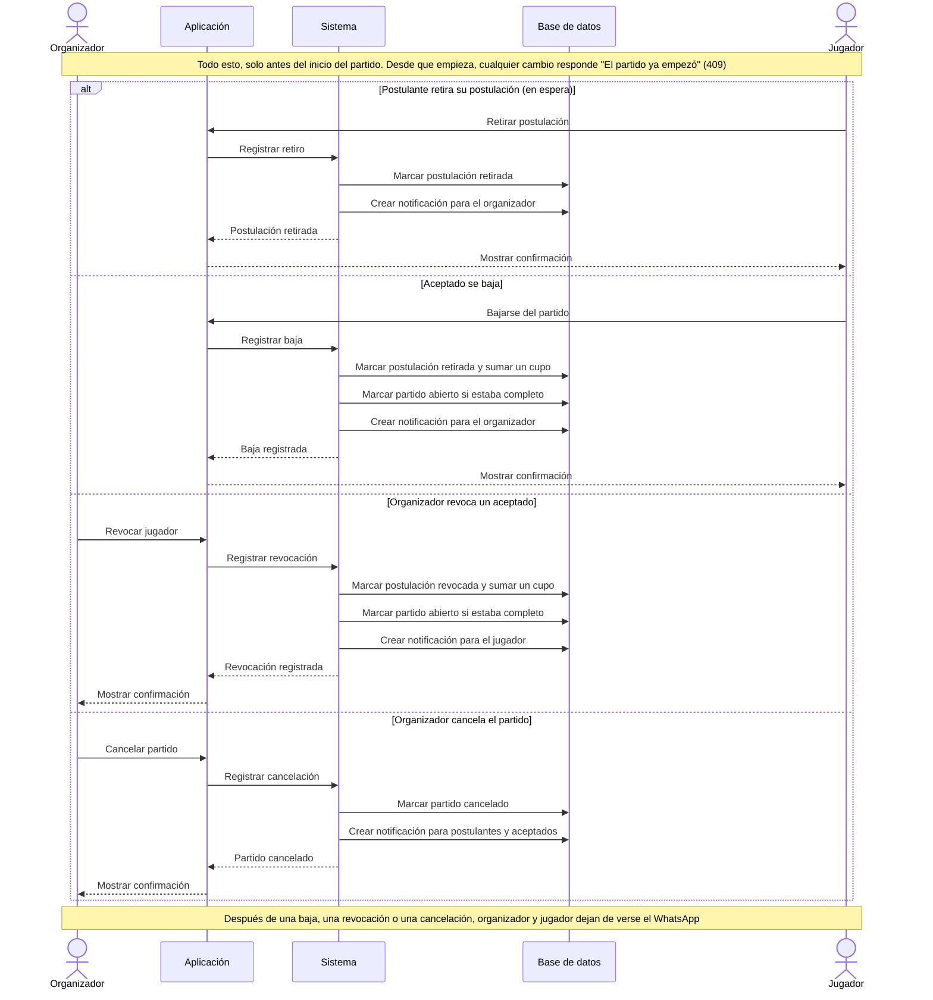

# Cancelaciones (RQ7)

```mermaid
sequenceDiagram
    actor O as Organizador
    participant A as Aplicación
    participant S as Sistema
    participant BD as Base de datos
    actor J as Jugador

    Note over O,J: Todo esto, solo antes del inicio del partido. Desde que empieza, cualquier cambio responde "El partido ya empezó" (409)
    alt Postulante retira su postulación (en espera)
        J->>A: Retirar postulación
        A->>S: Registrar retiro
        S->>BD: Marcar postulación retirada
        S->>BD: Crear notificación para el organizador
        S-->>A: Postulación retirada
        A-->>J: Mostrar confirmación
    else Aceptado se baja
        J->>A: Bajarse del partido
        A->>S: Registrar baja
        S->>BD: Marcar postulación retirada y sumar un cupo
        S->>BD: Marcar partido abierto si estaba completo
        S->>BD: Crear notificación para el organizador
        S-->>A: Baja registrada
        A-->>J: Mostrar confirmación
    else Organizador revoca un aceptado
        O->>A: Revocar jugador
        A->>S: Registrar revocación
        S->>BD: Marcar postulación revocada y sumar un cupo
        S->>BD: Marcar partido abierto si estaba completo
        S->>BD: Crear notificación para el jugador
        S-->>A: Revocación registrada
        A-->>O: Mostrar confirmación
    else Organizador cancela el partido
        O->>A: Cancelar partido
        A->>S: Registrar cancelación
        S->>BD: Marcar partido cancelado
        S->>BD: Crear notificación para postulantes y aceptados
        S-->>A: Partido cancelado
        A-->>O: Mostrar confirmación
    end
    Note over O,J: Después de una baja, una revocación o una cancelación, organizador y jugador dejan de verse el WhatsApp
```
