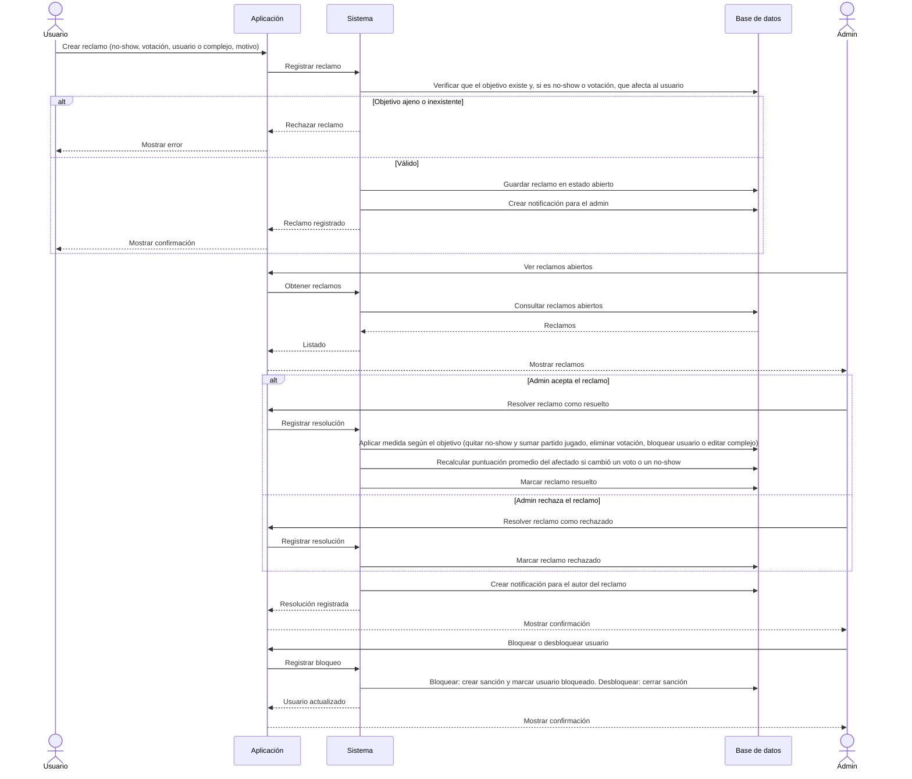

# Reclamos y resolución del admin (RQ10, RQ11)

Nuevo: el doc viejo solo mencionaba "resolver disputas" sin secuencia.

```mermaid
sequenceDiagram
    actor U as Usuario
    participant A as Aplicación
    participant S as Sistema
    participant BD as Base de datos
    actor D as Admin

    U->>A: Crear reclamo (no-show, votación, usuario o complejo, motivo)
    A->>S: Registrar reclamo
    S->>BD: Verificar que el objetivo existe y, si es no-show o votación, que afecta al usuario
    alt Objetivo ajeno o inexistente
        S-->>A: Rechazar reclamo
        A-->>U: Mostrar error
    else Válido
        S->>BD: Guardar reclamo en estado abierto
        S->>BD: Crear notificación para el admin
        S-->>A: Reclamo registrado
        A-->>U: Mostrar confirmación
    end

    D->>A: Ver reclamos abiertos
    A->>S: Obtener reclamos
    S->>BD: Consultar reclamos abiertos
    BD-->>S: Reclamos
    S-->>A: Listado
    A-->>D: Mostrar reclamos

    alt Admin acepta el reclamo
        D->>A: Resolver reclamo como resuelto
        A->>S: Registrar resolución
        S->>BD: Aplicar medida según el objetivo (quitar no-show y sumar partido jugado, eliminar votación, bloquear usuario o editar complejo)
        S->>BD: Recalcular puntuación promedio del afectado si cambió un voto o un no-show
        S->>BD: Marcar reclamo resuelto
    else Admin rechaza el reclamo
        D->>A: Resolver reclamo como rechazado
        A->>S: Registrar resolución
        S->>BD: Marcar reclamo rechazado
    end
    S->>BD: Crear notificación para el autor del reclamo
    S-->>A: Resolución registrada
    A-->>D: Mostrar confirmación

    D->>A: Bloquear o desbloquear usuario
    A->>S: Registrar bloqueo
    S->>BD: Bloquear: crear sanción y marcar usuario bloqueado. Desbloquear: cerrar sanción
    S-->>A: Usuario actualizado
    A-->>D: Mostrar confirmación
```
