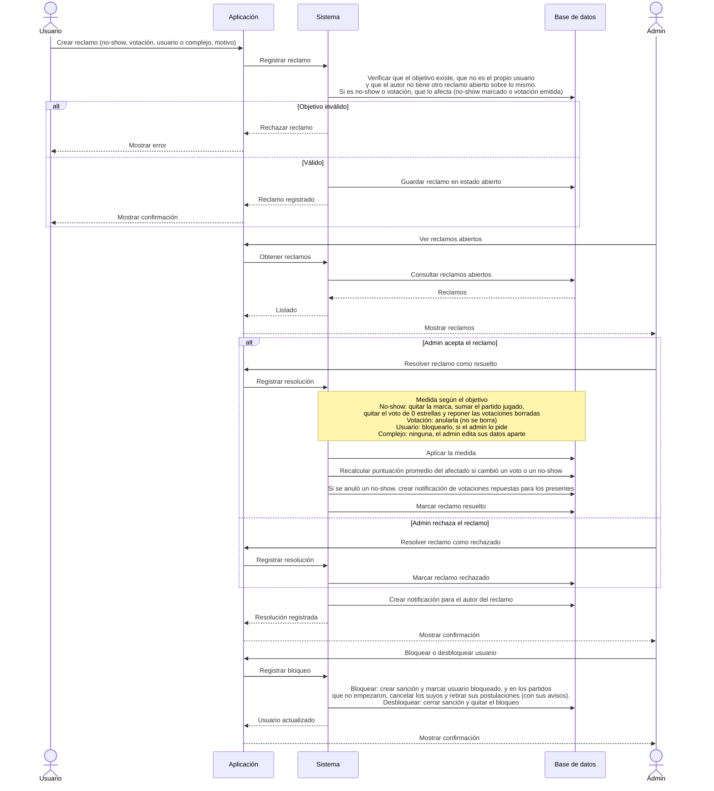

# Reclamos y resolución del admin (RQ10, RQ11)

```mermaid
sequenceDiagram
    actor U as Usuario
    participant A as Aplicación
    participant S as Sistema
    participant BD as Base de datos
    actor D as Admin

    U->>A: Crear reclamo (no-show, votación, usuario o complejo, motivo)
    A->>S: Registrar reclamo
    S->>BD: Verificar que el objetivo existe, que no es el propio usuario<br/>y que el autor no tiene otro reclamo abierto sobre lo mismo.<br/>Si es no-show o votación, que lo afecta (no-show marcado o votación emitida)
    alt Objetivo inválido
        S-->>A: Rechazar reclamo
        A-->>U: Mostrar error
    else Válido
        S->>BD: Guardar reclamo en estado abierto
        S-->>A: Reclamo registrado
        A-->>U: Mostrar confirmación
    end

    D->>A: Ver reclamos abiertos
    A->>S: Obtener reclamos
    S->>BD: Consultar reclamos abiertos
    BD-->>S: Reclamos
    S-->>A: Listado
    A-->>D: Mostrar reclamos

    alt Admin acepta el reclamo
        D->>A: Resolver reclamo como resuelto
        A->>S: Registrar resolución
        Note over S,BD: Medida según el objetivo<br/>No-show: quitar la marca, sumar el partido jugado,<br/>quitar el voto de 0 estrellas y reponer las votaciones borradas<br/>Votación: anularla (no se borra)<br/>Usuario: bloquearlo, si el admin lo pide<br/>Complejo: ninguna, el admin edita sus datos aparte
        S->>BD: Aplicar la medida
        S->>BD: Recalcular puntuación promedio del afectado si cambió un voto o un no-show
        S->>BD: Si se anuló un no-show, crear notificación de votaciones repuestas para los presentes
        S->>BD: Marcar reclamo resuelto
    else Admin rechaza el reclamo
        D->>A: Resolver reclamo como rechazado
        A->>S: Registrar resolución
        S->>BD: Marcar reclamo rechazado
    end
    S->>BD: Crear notificación para el autor del reclamo
    S-->>A: Resolución registrada
    A-->>D: Mostrar confirmación

    D->>A: Bloquear o desbloquear usuario
    A->>S: Registrar bloqueo
    S->>BD: Bloquear: crear sanción y marcar usuario bloqueado, y en los partidos<br/>que no empezaron, cancelar los suyos y retirar sus postulaciones (con sus avisos).<br/>Desbloquear: cerrar sanción y quitar el bloqueo
    S-->>A: Usuario actualizado
    A-->>D: Mostrar confirmación
```
